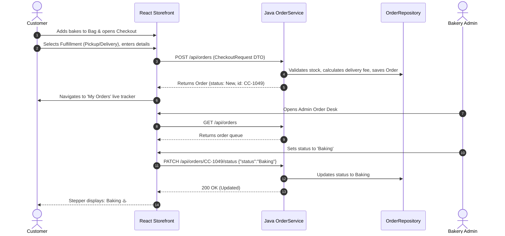

# 🥐 Crumble & Cream — Artisan Bakery Management & Storefront System

[](https://www.oracle.com/java/)
[](https://spring.io/projects/spring-boot)
[](https://react.dev/)
[](https://vitejs.dev/)
[](https://maven.apache.org/)
[](LICENSE)

An enterprise-grade, full-stack **Artisan Bakery Storefront, Ordering, and Behind-the-Counter Fulfillment Desk** implemented with a robust **Java / Spring Boot** backend architecture and a high-performance **React 19** frontend.

Designed with clean Object-Oriented Programming (OOP) principles, strict Role-Based Access Control (RBAC), and automated fulfillment workflows.

---

## 📋 Academic & Course Submission Details

> *This repository is formatted for academic project submission, technical interviews, and portfolio evaluation.*

| Field | Details |
| :--- | :--- |
| **Project Title** | Crumble & Cream: Full-Stack Bakery Order Management System |
| **Course / Subject** | Advanced Java Programming / Object-Oriented Software Engineering |
| **Language / Platform** | Java (JDK 8+) & JavaScript (ES6+ / React 19) |
| **Backend Framework** | Spring Boot / Java Core HTTP Server |
| **Frontend Framework** | React 19, Vite, Modern CSS3 Design Tokens |
| **Build Tool** | Apache Maven (`pom.xml`) & NPM |
| **Author / Student Name** | `[Your Name Here]` |
| **Roll Number / Student ID** | `[Your Roll Number]` |
| **Department / College** | Computer Science & Engineering |

---

## 📑 Table of Contents

- [System Architecture](#-system-architecture)
- [Key Features](#-key-features)
- [Role-Based Access Control & Test Credentials](#-role-based-access-control--test-credentials)
- [Object-Oriented Design & Patterns Applied](#-object-oriented-design--patterns-applied)
- [Project Directory Structure](#-project-directory-structure)
- [REST API Reference](#-rest-api-reference)
- [Quick Start Guide](#-quick-start-guide)
  - [Option 1: Zero-Dependency Java Standalone Server](#option-1-zero-dependency-java-standalone-server-recommended)
  - [Option 2: Spring Boot via Apache Maven](#option-2-spring-boot-via-apache-maven)
  - [Option 3: Vite Modern Frontend Development](#option-3-vite-modern-frontend-development)
- [Database Schema (Supabase / Relational)](#-database-schema)
- [Screenshots & User Flow](#-screenshots--user-flow)

---

## 🏛 System Architecture

The application adopts a decoupled **Layered Client-Server Architecture** utilizing standard RESTful HTTP APIs and thread-safe persistence layers.

```mermaid
graph TD
    subgraph Client Layer [Frontend Presentation Layer]
        A[React 19 Storefront] --> B[Catalog & Product Filter]
        A --> C[Interactive Shopping Bag]
        A --> D[Multi-Step Checkout Page]
        A --> E[Customer 'My Orders' Stepper]
        A --> F[Admin Order Desk]
    end

    subgraph Controller Layer [Spring Boot / Java HTTP Controllers]
        G[AuthController]
        H[ProductController]
        I[OrderController]
        J[HealthController]
    end

    subgraph Service Layer [Business Logic & Validation]
        K[AuthService]
        L[ProductService]
        M[OrderService]
    end

    subgraph Repository Layer [Data Access & In-Memory / JPA Store]
        N[UserRepository]
        O[ProductRepository]
        P[OrderRepository]
    end

    Client Layer -->|HTTP / JSON REST API| Controller Layer
    Controller Layer --> Service Layer
    Service Layer --> Repository Layer
```

### Order Lifecycle Sequence Diagram



---

## ✨ Key Features

### 1. Customer Storefront
- **Dynamic Catalog Filter**: Filter through categories including *All bakes*, *Cakes*, *Pastries*, *Breads*, *Cupcakes*, and *Brownies*.
- **Interactive Shopping Bag Drawer**: Real-time quantity increment/decrement, persistent calculations, and direct checkout link.
- **Visual Design & Typography**: Warm editorial aesthetic using custom typography, responsive CSS grid, and micro-animations.

### 2. Multi-Step Checkout Experience
- **Step 01: Contact Information**: Auto-fills details for logged-in users; captures phone number and email for order updates.
- **Step 02: Fulfillment Preferences**:
  - **🏪 Bakery Pickup**: Free of charge; lists pickup address and estimated turnaround (20–30 mins).
  - **🛵 Doorstep Delivery**: Automatically computes delivery fee (Free for orders ₹500+, ₹50 otherwise) and captures full street address, city, and PIN code.
  - **Special Baking Instructions**: Custom text box for cake icing messages, gift boxing, allergy notes, and ASAP vs Scheduled timing.
- **Step 03: Payment Methods**: Select between *Pay at Counter / Cash on Delivery*, *Instant UPI QR Scan*, and *Credit/Debit Card*.
- **Live Summary Sidebar**: Interactive subtotal, taxes & packaging indicator, delivery fee calculation, and instant validation.

### 3. Customer "My Orders" Portal
- **Role Isolation**: Strict privacy separation—customers only see orders placed under their own account.
- **Live Visual Stepper**: Progress stages: `Received` ➔ `Baking` ➔ `Ready / Out for Delivery` ➔ `Completed`.
- **Order Receipts**: Complete itemized breakdown with prices, quantities, notes, and fulfillment badge.

### 4. Admin Behind-the-Counter Order Desk
- **Restricted Access**: Accessible only to users authenticated with the `admin` role. Non-admin users attempting to open the desk are served a secure access denial screen.
- **Live Production Queue**: View all incoming orders across the city in chronological order.
- **One-Click Status Workflow**: Transition orders seamlessly between `New`, `Confirmed`, `Baking`, `Ready`, `Completed`, and `Cancelled`.
- **Operational Metrics**: Real-time counter of active orders in the oven and pending pickups.

---

## 🔐 Role-Based Access Control & Test Credentials

The application includes pre-seeded authentication credentials for testing both roles immediately:

| Role | Email Address | Password | Permissions & Views |
| :--- | :--- | :--- | :--- |
| **Administrator** | `admin@crumbleandcream.com` | `Admin@12345` | Access to **Order Desk**, updates live statuses, monitors production queue. |
| **Customer** | `customer@example.com` | `Customer@12345` | Storefront browsing, bag management, checkout, and private **My Orders** page. |

> 💡 **Quick Fill Feature:** Click the **Account / Sign In** button in the top navigation bar. Dedicated quick-fill buttons populate both test credentials with a single click.

---

## ☕ Object-Oriented Design & Patterns Applied

For academic assessment and software engineering review, this codebase incorporates standard OOP principles and design patterns:

1. **Model-View-Controller (MVC) Pattern**:
   - `model/`: Plain Old Java Objects (`User`, `Product`, `Order`, `OrderItem`, `DeliveryAddress`).
   - `controller/`: REST endpoints exposing clean contract interfaces.
   - `View`: React 19 Single Page Application consuming JSON payloads.
2. **Data Transfer Object (DTO) Pattern**:
   - `CheckoutRequest`, `CheckoutItemDto`, `LoginRequest`, `AuthResponse`, and `ApiResponse<T>` decouple the internal entity representation from network serialization.
3. **Repository Pattern (DAO)**:
   - `UserRepository`, `ProductRepository`, and `OrderRepository` abstract data persistence and provide thread-safe operations with `ConcurrentHashMap`.
4. **Service Layer Pattern**:
   - `AuthService`, `ProductService`, and `OrderService` encapsulate domain business logic and validation away from HTTP transport concerns.
5. **Singleton & Dependency Injection**:
   - Spring configuration beans manage service and repository lifecycles.
6. **Encapsulation & Type Safety**:
   - Domain enums (`Role`, `OrderStatus`, `FulfillmentType`) prevent illegal states and enforce compiler-checked domain constraints.

---

## 📂 Project Directory Structure

```text
baker main/
├── pom.xml                                       # Maven project descriptor (Spring Boot 2.7.x / Java 8)
├── package.json                                  # Node.js dependencies & scripts
├── vite.config.js                                # Vite bundler configuration
├── run-java.bat                                  # Direct script to compile & run Java server
├── build-and-run-java.bat                        # Full build script (Frontend + Java server)
│
├── src/
│   ├── main/
│   │   ├── java/com/crumbleandcream/bakery/
│   │   │   ├── BakeryApplication.java            # Spring Boot application entry point
│   │   │   ├── StandaloneBakeryServer.java       # Zero-dependency Java HTTP & REST server
│   │   │   │
│   │   │   ├── model/                            # Domain Entities (OOP)
│   │   │   │   ├── Role.java                     # Role enum (ADMIN, CUSTOMER)
│   │   │   │   ├── OrderStatus.java              # Order states (NEW, BAKING, etc.)
│   │   │   │   ├── FulfillmentType.java          # PICKUP / DELIVERY
│   │   │   │   ├── User.java                     # User model
│   │   │   │   ├── Product.java                  # Product model
│   │   │   │   ├── Order.java                    # Order model
│   │   │   │   ├── OrderItem.java                # Line item model
│   │   │   │   └── DeliveryAddress.java          # Address value object
│   │   │   │
│   │   │   ├── dto/                              # Data Transfer Objects
│   │   │   │   ├── LoginRequest.java             # Auth DTO
│   │   │   │   ├── AuthResponse.java             # Token/User response DTO
│   │   │   │   ├── CheckoutItemDto.java          # Item payload
│   │   │   │   ├── CheckoutRequest.java          # Full checkout submission
│   │   │   │   ├── StatusUpdateRequest.java      # Order status patch
│   │   │   │   └── ApiResponse.java              # Generic response wrapper
│   │   │   │
│   │   │   ├── repository/                       # Data Persistence Layer
│   │   │   │   ├── UserRepository.java           # User store
│   │   │   │   ├── ProductRepository.java        # Product store
│   │   │   │   └── OrderRepository.java          # Order store
│   │   │   │
│   │   │   ├── service/                          # Business Logic Layer
│   │   │   │   ├── AuthService.java              # Credential validation
│   │   │   │   ├── ProductService.java           # Catalog query logic
│   │   │   │   └── OrderService.java             # Fulfillment & pricing calculations
│   │   │   │
│   │   │   ├── controller/                       # Spring REST Controllers
│   │   │   │   ├── AuthController.java           # /api/auth
│   │   │   │   ├── ProductController.java        # /api/products
│   │   │   │   ├── OrderController.java          # /api/orders
│   │   │   │   └── HealthController.java         # /api/health
│   │   │   │
│   │   │   └── config/                           # Configuration & Seed Data
│   │   │       ├── WebConfig.java                # CORS & static resources
│   │   │       └── DataSeeder.java               # Seeds demo bakes & accounts
│   │   │
│   │   └── resources/
│   │       ├── application.properties            # Spring Boot configuration
│   │       └── static/                           # Bundled React frontend assets
│   │
│   ├── App.jsx                                   # React UI root (Storefront, Checkout, Orders)
│   ├── main.jsx                                  # React entry point
│   └── styles.css                                # Production CSS design tokens & layouts
│
└── supabase/                                     # Optional PostgreSQL Migrations
    ├── schema.sql                                # Schema, Tables & RLS Policies
    ├── seed.sql                                  # Complete database seeds
    └── seed_users.sql                            # User seed definitions
```

---

## 🔌 REST API Reference

### 1. Products API
- `GET /api/products` — Retrieve all handcrafted bakery items.
- `GET /api/products?category=Cakes` — Retrieve items filtered by category.
- `GET /api/products/{id}` — Retrieve item details by slug/ID.

### 2. Authentication API
- `POST /api/auth/login`
  ```json
  {
    "email": "customer@example.com",
    "password": "Customer@12345"
  }
  ```
  **Response (200 OK):**
  ```json
  {
    "success": true,
    "user": {
      "id": "customer-uuid-002",
      "email": "customer@example.com",
      "full_name": "Maya Patel",
      "role": "customer"
    },
    "token": "jwt-simulated-token-customer-uuid-002"
  }
  ```

### 3. Orders API
- `POST /api/orders` — Place a new customer order.
  ```json
  {
    "customer_name": "Maya Patel",
    "customer_email": "customer@example.com",
    "customer_phone": "+91 98765 43210",
    "fulfillment_type": "delivery",
    "delivery_address": {
      "street": "402 Sunshine Apts, Hill Road",
      "city": "Mumbai",
      "pinCode": "400050"
    },
    "notes": "[ASAP] Please write Happy Birthday on the cake.",
    "payment_method": "upi",
    "items": [
      { "product_id": "chocolate-truffle-cake", "quantity": 1, "unit_price": 799 }
    ]
  }
  ```
- `GET /api/orders` — Retrieve all orders (for Admin Order Desk).
- `GET /api/orders?customerId={id}` — Retrieve customer's personal order history.
- `PATCH /api/orders/{id}/status` — Update order progress state.
  ```json
  {
    "status": "Baking"
  }
  ```

---

## 🚀 Quick Start Guide

### Option 1: Zero-Dependency Java Standalone Server *(Recommended)*

No external tools or build managers required. Runs using standard JDK 8+ tools (`javac` and `java`).

```bash
# 1. Double click or run the batch script:
run-java.bat

# OR run manually via terminal:
mkdir bin
javac -d bin -sourcepath src/main/java src/main/java/com/crumbleandcream/bakery/StandaloneBakeryServer.java
java -cp bin com.crumbleandcream.bakery.StandaloneBakeryServer
```

Open your browser at **http://localhost:8080/** to view the full application.

---

### Option 2: Spring Boot via Apache Maven

If you have Apache Maven installed:

```bash
# 1. Package the application
mvn clean package

# 2. Run the executable JAR
java -jar target/bakery-order-system-1.0.0.jar

# OR run directly with Spring Boot plugin
mvn spring-boot:run
```

Access the application at **http://localhost:8080/**.

---

### Option 3: Vite Modern Frontend Development

To run with Hot Module Replacement (HMR) for frontend customization:

```bash
# 1. Install frontend dependencies
npm install

# 2. Start Vite development server
npm run dev
```

Visit the development server at **http://localhost:5173/**.

---

## 🗄 Database Schema (Supabase / Relational)

For setups connecting directly to a PostgreSQL database or Supabase instance, execute the SQL scripts in the `supabase/` folder:

```sql
-- Tables Created:
-- 1. profiles    (id, full_name, role, phone, updated_at)
-- 2. products    (id, name, slug, price, category, description, badge, calories, image)
-- 3. orders      (id, customer_id, customer_name, fulfillment_type, delivery_address, notes, status, total, created_at)
-- 4. order_items (id, order_id, product_id, product_name, quantity, unit_price)
```

1. Create a Supabase project at [supabase.com](https://supabase.com).
2. Execute [`supabase/schema.sql`](supabase/schema.sql) in the Supabase SQL editor.
3. Execute [`supabase/seed.sql`](supabase/seed.sql) to populate initial products and user roles.
4. Add your API credentials to `.env.local`:
   ```env
   VITE_SUPABASE_URL=https://your-project.supabase.co
   VITE_SUPABASE_ANON_KEY=your-anon-key
   ```

---

## 📄 License

This project is licensed under the MIT License — see the [LICENSE](LICENSE) file for details.
